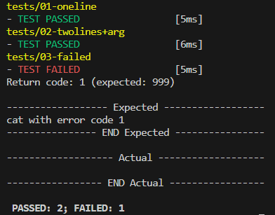

# universal-tester
Author: Jakub Mašek
## Usage

```
bash test.sh
```

## How to use
- Create a tests folder in the same directory as the script
- Create a folder for each test
- Create files as shown in the folder structure
- In the test.sh script change the path to the executable (for examle: ./myprog) and the name of the folder containing the tests (lines 8 and 11)
- Run the script ```bash test.sh```
- Results will be printed in the terminal and outputs saved in the tests folder

## Running the example
- Simply run ```bash test.sh``` and first two tests should pass and the third one should fail
- Outputs can be found in the tests folder

- Expected output:

  

## Folder structure
```
.
├── test.sh
└── tests
    ├── test1
    │   ├── *.input (optional)
    │   ├── *.args (optional)
    │   ├── *.refrc (optional; default return code is 0)   
    │   └── out.refout
    └── test2
        ├── *.input (optional)
        ├── *.args (optional)
        ├── *.refrc (optional; default return code is 0)  
        └── out.refout
```

